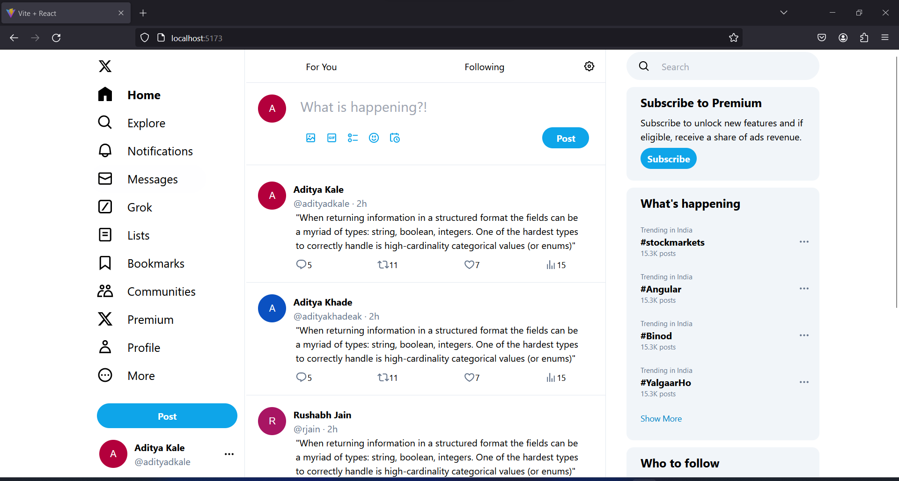
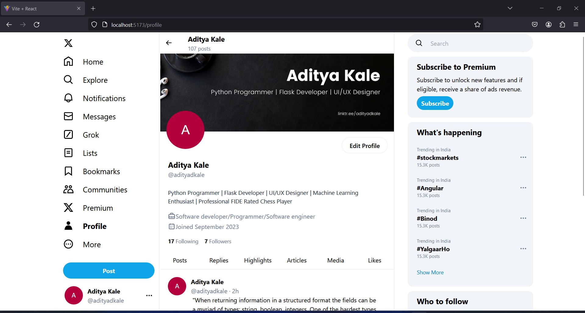

# Twitter Clone

This repository contains a project aimed at implementing a Twitter-like application using the MERN stack (MongoDB, Express.js, React.js, and Node.js). The project is in progress, and the repository will be updated as the development progresses.

## Disclaimer

This project is a work in progress and is intended for educational purposes only. The code and features presented here are not intended for production use. The author(s) of this repository are not responsible for any misuse or damage caused by the use of this code. All the images, trademarks and icons belong to X and its respective owners.

## Images
Images are subject to change as project evolves.

Home


Profile


## Getting Started

To get a local copy up and running, follow these steps:

1. Clone the repository:
   ```
   git clone https://github.com/AdityaDKale/twitterclone.git
   ```
2. Navigate to the project directory (work in progress):
   ```
   cd twitterclone/frontend/twitterclone
   ```
3. Install dependencies:
   ```
   npm install
   ```
4. Start the development server:
   ```
   npm start
   ```

## Contact

For any questions or concerns, please open an issue on this repository.

---

© 2024 AdityaDKale. All rights reserved.
